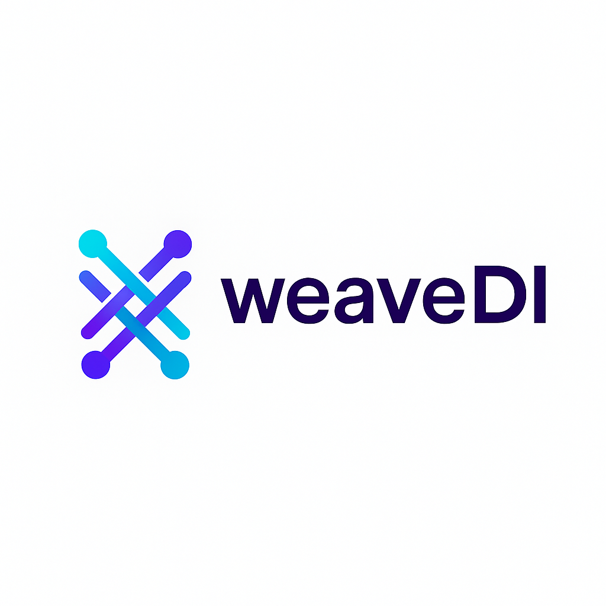

<p align="center">
 
</p>

# WeaveDI


[](https://github.com/Roy-wonji/WeaveDI/blob/main/LICENSE)

[](https://roy-wonji.github.io/WeaveDI/documentation/weavedi)

**현대적인 Swift Concurrency를 위한 간단하고 강력한 의존성 주입 프레임워크**

참고: 읽기(그래프/통계/최적화 여부)는 UnifiedDI/DIContainer의 동기 헬퍼를 사용하세요. 내부 AutoDIOptimizer의 읽기용 API는 스냅샷 기반 내부용이며 외부 직접 호출은 비권장(Deprecated)입니다.

## 🎯 핵심 특징

- ⚡ **Swift Concurrency 네이티브**: async/await와 Actor 완벽 지원
- 🔒 **타입 안전성**: 컴파일 타임 타입 검증
- 📝 **간단한 API**: 3개의 핵심 Property Wrapper만 기억하면 됨
- 🤖 **자동 최적화**: 의존성 그래프, Actor hop 감지, 타입 안전성 검증 자동화
- 🧪 **테스트 친화적**: 의존성 모킹과 격리 지원

## 🚀 빠른 시작

### 설치

```swift
dependencies: [
    .package(url: "https://github.com/Roy-wonji/WeaveDI.git", from: "2.0.0")
]
```

### 기본 사용법

```swift
import WeaveDI

// 1. 의존성 등록
let userService = UnifiedDI.register(UserServiceProtocol.self) {
    UserService()
}

// 2. Property Wrapper로 주입
class ViewController {
    @Inject var userService: UserServiceProtocol?     // 옵셔널 주입
    @Factory var generator: PDFGenerator              // 팩토리 (매번 새 인스턴스)
    @SafeInject var apiService: APIServiceProtocol?   // 안전한 주입
}

// 3. 안전한 주입 (에러 처리)
class SafeController {
    @SafeInject var apiService: APIServiceProtocol?

    func loadData() {
        do {
            let service = try apiService.getValue()
            // 안전하게 사용
        } catch {
            // 에러 처리
        }
    }
}
```

### 부트스트랩(앱 시작 시 초기화)

```swift
import WeaveDI

// 동기 부트스트랩
await DIContainer.bootstrap { di in
    di.register(Logger.self) { ConsoleLogger() }
    di.register(Networking.self) { DefaultNetworking() }
}

// 비동기 부트스트랩
let ok = await DIContainer.bootstrapAsync { di in
    let flags = try await FeatureFlags.fetch()
    di.register(FeatureFlags.self) { flags }
}

// 혼합 부트스트랩
@MainActor
await DIContainer.bootstrapMixed(
    sync: { di in di.register(Logger.self) { ConsoleLogger() } },
    async: { di in
        let analytics = await AnalyticsClient.make()
        di.register(AnalyticsClient.self) { analytics }
    }
)

// 조건부 부트스트랩
_ = await DIContainer.bootstrapIfNeeded { di in
    di.register(Config.self) { LocalConfig() }
}

// 보장/테스트
DIContainer.ensureBootstrapped()
@MainActor
DIContainer.resetForTesting() // DEBUG 전용
```

> 읽기(그래프/통계/최적화 여부)는 UnifiedDI/DIContainer의 동기 헬퍼 사용을 권장합니다. 내부 AutoDIOptimizer 리더는 스냅샷 기반 내부용이며, 외부 직접 호출은 비권장(Deprecated)입니다.

## 📚 핵심 API

### 등록 API

```swift
// 기본 등록 (권장)
let service = UnifiedDI.register(ServiceProtocol.self) {
    ServiceImpl()
}

// KeyPath 등록
let repository = UnifiedDI.register(\.userRepository) {
    UserRepositoryImpl()
}

// 조건부 등록
let service = UnifiedDI.Conditional.registerIf(
    ServiceProtocol.self,
    condition: isProduction,
    factory: { ProductionService() },
    fallback: { MockService() }
)

// 스코프 기반 등록
let sessionService = UnifiedDI.registerScoped(
    SessionService.self,
    scope: .session
) {
    SessionServiceImpl()
}
```

### Property Wrapper

| Property Wrapper | 용도 | 예시 |
|---|---|---|
| `@Inject` | 기본 주입 (옵셔널/필수) | `@Inject var service: Service?` |
| `@Factory` | 팩토리 패턴 (새 인스턴스) | `@Factory var generator: Generator` |
| `@SafeInject` | 안전한 주입 (throws) | `@SafeInject var api: API?` |

### 해결 API

```swift
// 일반 해결
let service = UnifiedDI.resolve(ServiceProtocol.self)

// 필수 해결 (없으면 크래시)
let logger = UnifiedDI.requireResolve(Logger.self)

// 기본값 포함 해결
let cache = UnifiedDI.resolve(Cache.self, default: MemoryCache())
```

## 🤖 자동 최적화

**별도 설정 없이 자동으로 실행됩니다:**

### 🔄 자동 의존성 그래프 생성

```swift
// 등록/해결만 하면 자동으로 그래프 생성 및 최적화
let service = UnifiedDI.register(UserService.self) { UserServiceImpl() }
let resolved = UnifiedDI.resolve(UserService.self)

// 자동 수집된 정보는 LogMacro로 자동 출력됩니다
// 📊 Auto tracking registration: UserService
// ⚡ Auto optimized: UserService (10 uses)
```

### 🎯 자동 Actor Hop 감지 및 최적화

```swift
// 해결하기만 하면 자동으로 Actor hop 감지
await withTaskGroup(of: Void.self) { group in
    for _ in 1...10 {
        group.addTask {
            _ = UnifiedDI.resolve(UserService.self) // Actor hop 자동 감지
        }
    }
}

// 자동 로그 (5회 이상 hop 발생 시):
// 🎯 Actor optimization suggestion for UserService: MainActor로 이동 권장
```

### 🔒 자동 타입 안전성 검증

```swift
// 해결 시 자동으로 타입 안전성 검증
let service = UnifiedDI.resolve(UserService.self)

// 자동 로그 (문제 감지 시):
// 🔒 Type safety issue: UserService is not Sendable
// 🚨 Auto safety check: UserService resolved to nil
```

### ⚡ 자동 성능 최적화

```swift
// 여러 번 사용하면 자동으로 최적화됨
for _ in 1...15 {
    let service = UnifiedDI.resolve(UserService.self)
}

// 최적화된 타입들은 자동으로 로깅됩니다
// ⚡ Auto optimized: UserService (15 uses)
```

### 📊 자동 사용 통계 수집

```swift
// 사용 통계는 30초마다 자동으로 로깅됩니다
// 📊 [AutoDI] Current stats: ["UserService": 15, "DataRepository": 8]
```

### 로깅 제어 (기본값: 모든 로그 활성화)

```swift
UnifiedDI.setLogLevel(.registration)  // 등록만 로깅
UnifiedDI.setLogLevel(.optimization)  // 최적화만 로깅
UnifiedDI.setLogLevel(.errors)       // 에러/경고만 로깅
UnifiedDI.setLogLevel(.off)          // 로깅 끄기
```

## 🧪 테스트

```swift
// 테스트용 초기화
@MainActor
override func setUp() {
    UnifiedDI.releaseAll()

    // 테스트용 의존성 등록
    _ = UnifiedDI.register(UserService.self) {
        MockUserService()
    }
}
```

## 📋 자동 수집 정보 확인

```swift
// 🔄 자동 생성된 의존성 그래프
UnifiedDI.autoGraph

// ⚡ 자동 최적화된 타입들
UnifiedDI.optimizedTypes

// 📊 자동 수집된 사용 통계
UnifiedDI.stats

// 🎯 Actor 최적화 제안 목록
UnifiedDI.actorOptimizations

// 🔒 타입 안전성 이슈 목록
UnifiedDI.typeSafetyIssues

// ⚡ Actor hop 통계
UnifiedDI.actorHopStats

// 📊 비동기 성능 통계 (밀리초)
UnifiedDI.asyncPerformanceStats
```

## 🔧 Deprecated 읽기 API (대체 경로)

아래 AutoDIOptimizer의 읽기용 API는 내부 스냅샷 기반으로 재구성되었으며, 외부 사용은 비권장(Deprecated)입니다. UnifiedDI/DIContainer의 동기 헬퍼를 사용하세요.

| Deprecated (AutoDIOptimizer) | Replacement |
|---|---|
| `getCurrentStats()` | `UnifiedDI.stats()` / `DIContainer.getUsageStatistics()` |
| `visualizeGraph()` | `UnifiedDI.autoGraph()` / `DIContainer.getAutoGeneratedGraph()` |
| `getFrequentlyUsedTypes()` | `UnifiedDI.optimizedTypes()` / `DIContainer.getOptimizedTypes()` |
| `getDetectedCircularDependencies()` | `UnifiedDI.circularDependencies()` / `DIContainer.getDetectedCircularDependencies()` |
| `isOptimized(_:)` | `UnifiedDI.isOptimized(_:)` / `DIContainer.isAutoOptimized(_:)` |
| `getActorOptimizationSuggestions()` | `UnifiedDI.actorOptimizations` |
| `getDetectedTypeSafetyIssues()` | `UnifiedDI.typeSafetyIssues` |
| `getDetectedAutoFixedTypes()` | `UnifiedDI.autoFixedTypes` |
| `getActorHopStats()` | `UnifiedDI.actorHopStats` |
| `getAsyncPerformanceStats()` | `UnifiedDI.asyncPerformanceStats` |
| `getRecentGraphChanges(...)` | `UnifiedDI.getGraphChanges(...)` |
| `getCurrentLogLevel()` | `UnifiedDI.logLevel` / `UnifiedDI.getLogLevel()` |

> 내부 용도로는 `AutoDIOptimizer.readSnapshot()`를 통해 스냅샷을 읽어 필요한 정보를 계산하세요.

## 🧪 성능 벤치 템플릿

실행:

```bash
swift run -c release Benchmarks -- --count 100000 --debounce 100

# 여러 조합 테스트(10k/100k/1M × 50/100/200ms)
swift run -c release Benchmarks
```

출력 예시:

```
📊 Bench: counts=[10000, 100000, 1000000], debounces=[50, 100, 200] (ms)
debounce= 50ms, n=     10000 | total=   12.34ms | p50= 0.010 p95= 0.020 p99= 0.030
...
```

CSV 저장 및 차트 생성(선택)

```bash
# CSV에 누적 저장
swift run -c release Benchmarks -- --count 100000 --debounce 100 --csv bench.csv

# 빠른 확인(첫 조합만)
swift run -c release Benchmarks -- --quick --csv bench.csv

# 텍스트 요약 + PNG 차트(선택, matplotlib 필요)
python3 Scripts/plot_bench.py --csv bench.csv --out bench_plot
```

> matplotlib이 없으면 텍스트 요약만 출력합니다. 설치: `pip install matplotlib`

## 📖 문서 및 튜토리얼

### 📚 공식 문서
- [API 문서](https://roy-wonji.github.io/WeaveDI/documentation/dicontainer)
- [자동 최적화 가이드](Sources/WeaveDI.docc/ko.lproj/AutoDIOptimizer.md)
- [Property Wrapper 가이드](Sources/WeaveDI.docc/ko.lproj/PropertyWrappers.md)
- [마이그레이션 3.0.0](Sources/WeaveDI.docc/ko.lproj/MIGRATION-3.0.0.md)

### ⚡ 핫패스 정적화 활성화 (USE_STATIC_FACTORY)

- 의미: 반복·프레임 루프 등 핫패스에서 런타임 해석을 없애 정적 생성/캐시로 대체해 비용을 0에 수렴하게 합니다.
- 사용 위치: 코드에 `#if USE_STATIC_FACTORY` 분기(이미 템플릿 포함) → 빌드 플래그로 on/off
- 활성화 방법
  - Xcode: Target → Build Settings → Other Swift Flags(Release 또는 전용 스킴)에 `-DUSE_STATIC_FACTORY` 추가
  - SPM CLI: `swift build -c release -Xswiftc -DUSE_STATIC_FACTORY`
    - 테스트: `swift test -c release -Xswiftc -DUSE_STATIC_FACTORY`

### 📏 성능 측정 가이드

- 반드시 Release + WMO(Whole‑Module Optimization)에서 측정하세요.
  - Xcode: Release 스킴으로 실행(Release는 기본적으로 WMO 적용)
  - SPM: `swift build -c release`, `swift test -c release`
- 노이즈 최소화 팁
  - 로그 레벨 낮추기: `UnifiedDI.setLogLevel(.errors)` 또는 `.off`
  - 자동 최적화 ON: `UnifiedDI.configureOptimization(...)`, `UnifiedDI.setAutoOptimization(true)`
  - 반복 루프는 resolve 캐시(루프 밖 1회 확보 → 안에서는 재사용)

### 🎯 튜토리얼
- [튜토리얼 모음(웹)](https://roy-wonji.github.io/WeaveDI/tutorials/weavedicontainers)

## 🎯 주요 차별점

### 🏆 vs Uber Needle: 모든 장점 + 더 나은 경험

| 특징 | Needle | WeaveDI | 결과 |
|------|--------|---------|------|
| **컴파일타임 안전성** | ✅ 코드 생성 | ✅ 매크로 기반 | **동등** |
| **런타임 성능** | ✅ 제로 코스트 | ✅ 제로 코스트 + Actor 최적화 | **WeaveDI 우승** |
| **Swift 6 지원** | ⚠️ 제한적 | ✅ 완벽 네이티브 | **WeaveDI 우승** |
| **코드 생성 필요** | ❌ 필수 | ✅ 선택적 | **WeaveDI 우승** |
| **학습 곡선** | ❌ 가파름 | ✅ 점진적 | **WeaveDI 우승** |
| **마이그레이션** | ❌ All-or-nothing | ✅ 점진적 | **WeaveDI 우승** |

```swift
// Needle 수준 성능 + 더 쉬운 사용법
UnifiedDI.enableStaticOptimization()  // Needle과 동일한 제로 코스트

@DependencyGraph([  // 컴파일타임 검증
    UserService.self: [NetworkService.self, Logger.self]
])
extension WeaveDI {}

print(UnifiedDI.migrateFromNeedle())  // Needle → WeaveDI 마이그레이션 가이드
```

### 1. 완전 자동화된 최적화
- **별도 설정 없이** Actor hop 감지, 타입 안전성 검증, 성능 최적화가 자동 실행
- **실시간 분석**으로 30초마다 최적화 수행 (Needle에 없는 기능)
- **개발자 친화적 제안**으로 성능 개선점 자동 안내

### 2. Swift Concurrency 네이티브 (Needle 대비 우위)
- **Actor 안전성** 자동 검증 및 최적화 제안
- **async/await 완벽 지원** (Needle은 제한적)
- **Sendable 프로토콜** 준수 검증

### 3. 단순하면서도 강력한 API
- **3개 Property Wrapper**만으로 모든 주입 패턴 커버
- **타입 안전한** KeyPath 기반 등록
- **직관적인** 조건부 등록

## 📄 라이선스

MIT License. 자세한 내용은 [LICENSE](LICENSE) 파일을 참고하세요.

## 👨‍💻 개발자

**서원지 (Roy, Wonji Suh)**
- 📧 [suhwj81@gmail.com](mailto:suhwj81@gmail.com)
- 🐙 [GitHub](https://github.com/Roy-wonji)

## 🤝 기여하기

WeaveDI를 더 좋게 만들어주세요!

### 기여 방법
1. **이슈 제기**: [GitHub Issues](https://github.com/Roy-wonji/WeaveDI/issues)에서 버그 리포트나 기능 요청
2. **Pull Request**: 개선사항이나 새로운 기능을 직접 구현해서 기여
3. **문서 개선**: README나 문서의 오타, 개선사항 제안

### 개발 환경 설정
```bash
git clone https://github.com/Roy-wonji/WeaveDI.git
cd WeaveDI
swift build
swift test
```

 

---
<div align="center">

<strong>WeaveDI와 함께 더 나은 Swift 개발 경험을 만들어가세요! 🚀</strong>

⭐ <strong>이 프로젝트가 도움이 되었다면 Star를 눌러주세요!</strong> ⭐

</div>
